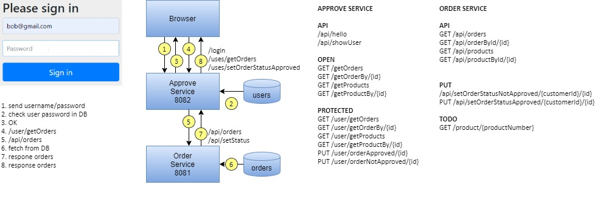

# Intro Mongo DB

* ORDER Service
* APPROVE Service
* Spring Security
* MongoDB
* swagger  

## Order service:

* Port:8081
* http://localhost:8081/swagger-ui.html#/order-controller
* GET http://localhost:8081/api/products
* GET http://localhost:8081/api/productById/5e761ef6359ba2588124d043
* GET http://localhost:8081/api/orders
* GET http://localhost:8081/api/order/5e7560064f6bc0c0011fd20a

## Approve service:

* Port:8082
* Spring Security 
* Users defined in MongoDB db.users
* login/logout
### LOCAL API 
* .antMatchers("/api/**").permitAll()
* GET http://localhost:8082/api/showUsers
* GET http://localhost:8082/api/hello)
* http://localhost:8082/swagger-ui.html
### Feign client proxy to ORDER Service 
#### Open
* .antMatchers("/**").permitAll()
* http://localhost:8082/getProductBy/{id} -> http://localhost:8081/api/productById/{id} 
* http://localhost:8082/getProducts -> http://localhost:8081/api/products
* http://localhost:8082/getOrderById/{id} -> http://localhost:8081/api/orderById/{id}
* http://localhost:8082/getOrders -> http://localhost:8081/api/orders
#### Protected
* .antMatchers("/user/**").hasAnyRole("USER", "ADMIN")
* http://localhost:8082/user/getProductById/{id}
* http://localhost:8082/user/getProducts
* http://localhost:8082/user/getOrderById/{id}
* http://localhost:8082/user/getOrders

## Requirements 
* Local MongoDB

## Build
    cd approve-service
    gradlew.bat build --warning-mode=all
    cd order-service
    gradlew.bat build --warning-mode=all
    

### Change Log

    2020-03-05 Lesson 05:
               add UsersController /username /username2 /username3 /username4
               add updateOrderStatus(String id, String customerId, String username, Order.Status newStatus)
               add /api/setOrderStatusNotApproved/{customerId}/{id}
               add /api/setOrderStatusApproved/{customerId}/{id}
    2020-03-22 Lesson 04:
               add feign clinet
               add /user/getOrders /user/getOrderBy/{id}
               add /user/getProducts /user/getProductBy/{id}
               add /getOrders /getOrderBy/{id}
               add /getProducts /getProductBy/{id}
               add /public/error/404.html
               add /public/error/401.html
               add /public/index.html
    2020-03-21 Lesson 03: 
               add Spring Security Approve Service users validated in MongoDB db.users
               add greeting.html
               add @Secured("ROLE_ADMIN") /admin/index                
    2020-03-21 Lesson 02:
               add Order Service with MongoDB connection (orders, products) 
               add Approve Service with MongoDB connection (users)
               add Spring Security basic authentication (bob/password) defined in application.properties
    2020-03-20 add Initial version project setup 
     
